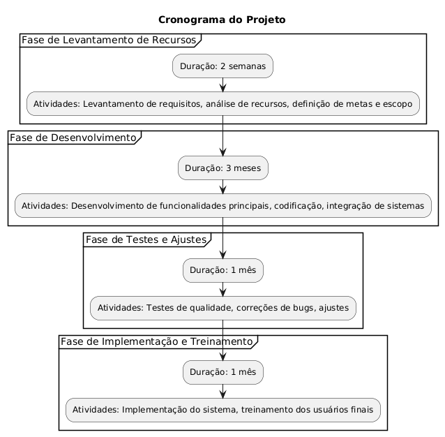
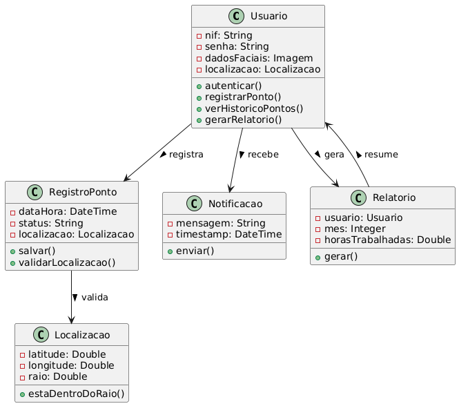
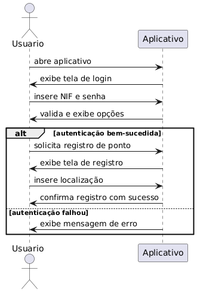
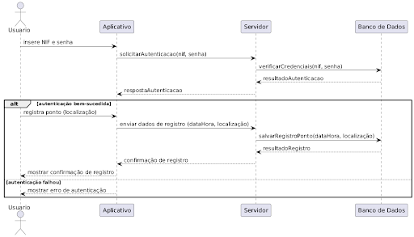

# Tema 1: App de Registro de Ponto com Geolocalização e Biometria

## 1. Descrição do Projeto
Desenvolver um aplicativo móvel para uma clínica médica que permite aos funcionários registrar seu ponto de trabalho, utilizando geolocalização para garantir que o registro ocorra a até 100 metros do local de trabalho. A autenticação será feita por meio de NIF e senha ou reconhecimento facial via biometria. O aplicativo deverá garantir segurança, eficiência e conformidade com regulamentações de proteção de dados, especialmente em relação ao manejo de informações sensíveis de saúde.

## 2. Funcionalidades Principais

### Autenticação do Usuário
- **NIF e Senha**: Permitir que o usuário se autentique com seu NIF e uma senha.
- **Reconhecimento Facial**: Implementar um sistema de biometria para reconhecimento facial como método alternativo de autenticação.

### Registro de Ponto
- **Entrada e Saída**: Permitir que o usuário registre sua entrada, saída e intervalos.
- **Armazenamento**: Registrar cada ponto com data, hora e localização GPS.

### Verificação de Geolocalização
- **Localização Permitida**: Validar se o usuário está dentro do raio de 100 metros do local de trabalho no momento do registro.
- **Notificações**: Informar ao usuário se o registro não puder ser realizado devido à localização.

### Histórico de Registros
- **Acesso ao Histórico**: Permitir que os usuários visualizem seus registros anteriores de ponto.
- **Relatórios**: Geração de relatórios mensais com informações sobre horas trabalhadas.

### Integração com Firebase
- **Autenticação**: Utilizar Firebase Authentication para gerenciar credenciais de usuários.
- **Armazenamento de Dados**: Usar Firebase Firestore para armazenar registros de ponto e dados do usuário.

### Suporte e Ajuda
- **Seção de FAQs**: Incluir uma seção de perguntas frequentes e tutoriais para ajudar os usuários.
- **Suporte Técnico**: Canal de suporte via chat ou e-mail para resolução de problemas.

## 3. Requisitos Funcionais
1. O sistema deve permitir que o usuário se autentique usando NIF e senha.
2. O sistema deve permitir autenticação via reconhecimento facial.
3. O sistema deve registrar ponto com data, hora e localização.
4. O sistema deve validar a localização do usuário antes de permitir o registro.
5. O sistema deve permitir acesso ao histórico de registros de ponto.
6. O sistema deve gerar relatórios mensais de horas trabalhadas.

## 4. Requisitos Não Funcionais
1. O aplicativo deve ser compatível com Android e iOS.
2. O sistema deve garantir a segurança dos dados por meio de criptografia.
3. O tempo de resposta para registrar o ponto deve ser inferior a 2 segundos.
4. O aplicativo deve ter uma interface intuitiva e responsiva.
5. O sistema deve operar offline, armazenando dados localmente até que a conexão esteja disponível.

## 5. Escopo do Projeto

### 5.1 Inclusões
- Desenvolvimento do aplicativo para dispositivos móveis (Android e iOS).
- Integração com Firebase para autenticação e armazenamento de dados.
- Implementação de geolocalização e reconhecimento facial.
- Criação de relatórios e histórico de registros.

### 5.2 Exclusões
- Versões para desktop ou web.
- Funcionalidades de gestão de recursos humanos não especificadas.
- Integração com sistemas de terceiros não previstos inicialmente.

---

## Levantamento de Recursos

### 1. Recursos de Desenvolvimento
- **Framework**: Flutter
- **Linguagem de Programação**: Dart
- **IDE**: Visual Studio Code ou Android Studio

# Bibliotecas e Pacotes Necessários

Este projeto utiliza várias bibliotecas e pacotes para implementar funcionalidades essenciais, como autenticação, geolocalização, biometria, e gerenciamento de dados. Abaixo estão os pacotes que serão utilizados e uma breve descrição de cada um.

## 1. **Autenticação**
- **`firebase_auth`**: 
  - Utilizado para autenticar usuários com NIF (Número de Identificação Fiscal) e senha.
  - Permite integrar o Firebase Authentication para fornecer um fluxo seguro de login.
  
## 2. **Geolocalização**
- **`geolocator`**: 
  - Usado para obter a localização atual do usuário.
  - Permite validar a geolocalização, verificando se o usuário está em um local específico para realizar o registro de ponto.

- **`location`**: 
  - Gerencia as permissões de acesso à localização do dispositivo.
  - Auxilia na coleta de dados de localização com as permissões adequadas no Android e iOS.

## 3. **Reconhecimento Facial e Biometria**
- **`local_auth`**: 
  - Usado para implementar autenticação biométrica (impressão digital, FaceID).
  - Permite realizar o login por biometria, proporcionando uma forma de autenticação mais rápida e segura para os usuários.

## 4. **Armazenamento de Dados**
- **`cloud_firestore`**: 
  - Utilizado para armazenar e sincronizar registros de ponto no Firebase Firestore.
  - Permite gerenciar dados do usuário de forma eficiente e segura na nuvem.

- **`shared_preferences`**: 
  - Usado para armazenamento local de dados, como configurações de usuário ou informações temporárias, de forma simples e persistente.

## 5. **UI/UX e Gerenciamento de Estado**
- **`flutter_bloc` ou `provider`**:
  - Ambos são usados para gerenciamento de estado no Flutter.
  - O **`flutter_bloc`** oferece um padrão baseado no BLoC para gerenciar o estado de forma reativa.
  - O **`provider`** é uma alternativa mais simples e direta para gerenciar estados e dependências em toda a aplicação.

- **`flutter_svg`**: 
  - Usado para renderizar e manipular ícones no formato SVG (Scalable Vector Graphics).
  - Essencial para implementar ícones vetoriais, escaláveis e com boa performance no aplicativo.

## Como Adicionar ao Projeto

No seu arquivo `pubspec.yaml`, adicione as dependências abaixo:

```yaml
dependencies:
  firebase_auth: ^4.6.0
  geolocator: ^9.0.2
  location: ^5.0.0
  local_auth: ^2.1.3
  cloud_firestore: ^4.10.1
  shared_preferences: ^2.1.1
  flutter_bloc: ^8.1.2 # ou provider: ^6.1.3
  flutter_svg: ^1.1.1
```

### 3. Recursos de Design
- **Ferramentas de Design**: Figma ou Adobe XD.
- **Diretrizes de Design**: Material Design.

### 4. Infraestrutura
- **Firebase**: Configuração de um projeto Firebase para autenticação e Firestore.

### 5. Ambiente de Teste
- **Dispositivos**: Android e iOS.
- **Emuladores**: Android Emulator e iOS Simulator.

### 6. Recursos Humanos
- **Equipe de Desenvolvimento**
  - 1-2 Desenvolvedores Flutter.
  - 1 Designer UX/UI.
  - 1 Especialista em Segurança de Dados.
  - 1 Gerente de Projetos.

### 7. Treinamento e Suporte
- **Documentação**: Criar documentação detalhada.
- **Treinamento**: Sessões de treinamento para usuários finais.

### 8. Cronograma
- **Fase de Levantamento de Recursos**: 2 semanas
- **Fase de Desenvolvimento**: 3 meses
- **Fase de Testes e Ajustes**: 1 mês
- **Fase de Implementação e Treinamento**: 1 mês



---

## Análise de Riscos

### 1. Riscos Técnicos
- **Integração com Firebase**
  - **Descrição**: Problemas na integração podem causar falhas na autenticação e no armazenamento de dados.
  - **Mitigação**: Realizar testes rigorosos de integração e manter documentação detalhada.

- **Geolocalização Inconsistente**
  - **Descrição**: A precisão pode ser afetada por sinal fraco de GPS.
  - **Mitigação**: Verificação de localização em múltiplos pontos antes de registrar.

- **Reconhecimento Facial Ineficiente**
  - **Descrição**: O reconhecimento pode falhar em condições de pouca luz.
  - **Mitigação**: Incluir método alternativo de autenticação e realizar testes em diversas condições.

### 2. Riscos de Segurança
- **Vazamento de Dados Pessoais**
  - **Descrição**: Armazenamento de dados sensíveis pode ser alvo de ataques cibernéticos.
  - **Mitigação**: Implementar criptografia de dados.

- **Autenticação Fraudulenta**
  - **Descrição**: Tentativas de acesso não autorizado.
  - **Mitigação**: Bloqueio de conta após tentativas falhas e alertas de atividades suspeitas.

### 3. Riscos Operacionais
- **Adesão do Usuário**
  - **Descrição**: Resistência em utilizar o aplicativo.
  - **Mitigação**: Realizar sessões de treinamento e comunicar benefícios.

- **Suporte Técnico Insuficiente**
  - **Descrição**: Dificuldades em fornecer suporte adequado.
  - **Mitigação**: Criar uma equipe de suporte dedicada.

### 4. Riscos de Conformidade
- **Não Conformidade com Regulamentações**
  - **Descrição**: O aplicativo pode não atender a requisitos legais.
  - **Mitigação**: Consultar especialistas em compliance e realizar auditorias regulares.

---

## Diagramas

### Diagrama de Classe


### Diagrama de Uso


### Diagrama de Fluxo

